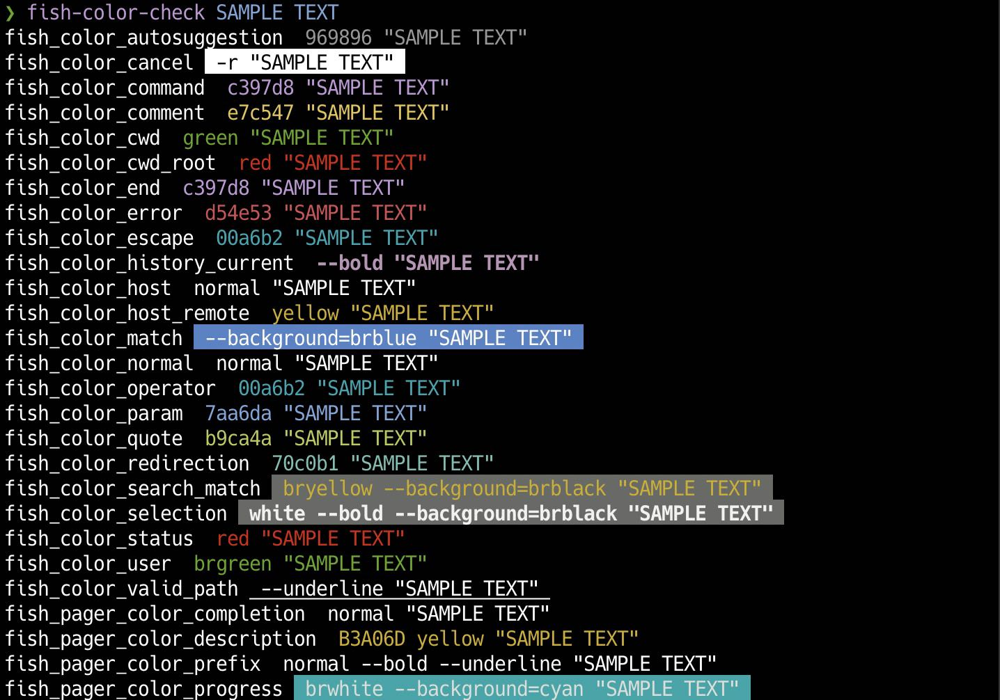

# fish-color-check 🌈
> *Simple fish plugin to check your fish shell configured colors*



## Installation

Using [fisher](https://github.com/jorgebucaran/fisher):

```console
fisher install yo-goto/fish-color-check
```

Update

```console
fisher update yo-goto/fish-color-check
```

## Usage

```console
USAGE:
      fish-color-check [OPTION]
      fish-color-check [SAMPLETEXT]
OPTIONS:
      -v, --version     Show version info
      -h, --help        Show help
      -p, --print       Show a list of the 16 named colors
```

You can also check fish color variable names in the docs.
- [Interactive use — fish-shell 3.3.1 documentation](https://fishshell.com/docs/current/interactive.html?highlight=pager_color#syntax-highlighting-variables)

## Change log
- [CHANGELOG.md](/CHANGELOG.md)


